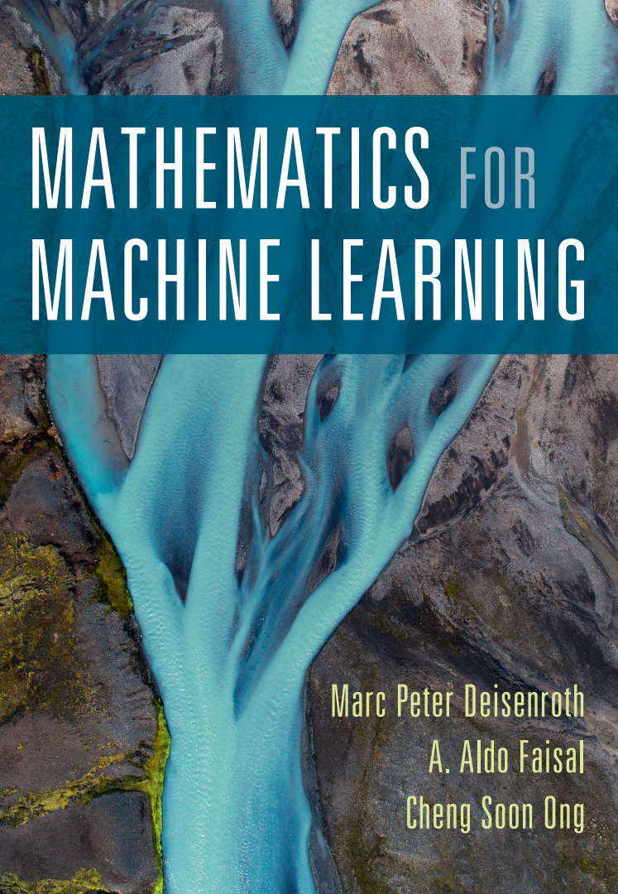
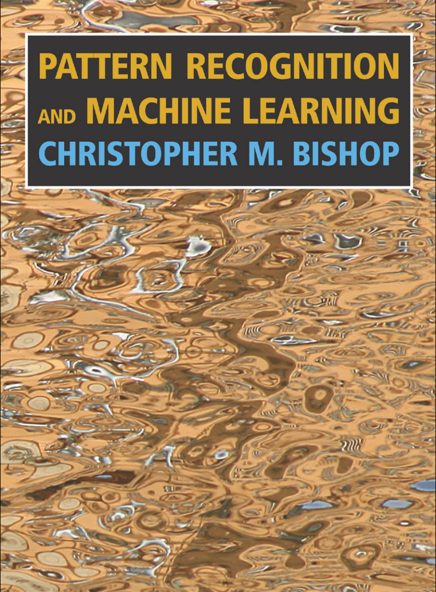

# NLP-Papers

Papers and Book to look at when starting NLP. I will continue to update the content!! 🚀

## Basic knowledge

| mathematics                                                                          | machine learning                                                                                                                                                                            |
|:------------------------------------------------------------------------------------:|:-------------------------------------------------------------------------------------------------------------------------------------------------------------------------------------------:|
|  |  |
| **[mathematics for machine learning](https://mml-book.github.io/)** | **[Pattern Recognition and Machine Learning](http://users.isr.ist.utl.pt/~wurmd/Livros/school/)** |

## Papers

- [2013/01] **[Efficient Estimation of Word Representations in Vector Space](https://arxiv.org/pdf/1301.3781.pdf)**    

- [2014/12] **[Dependency-Based Word Embeddings](https://www.aclweb.org/anthology/P14-2050.pdf)**

- [2015/07] **[Neural Machine Translation of Rare Words with Subword Units](https://www.aclweb.org/anthology/P16-1162.pdf)**

- [2014/07] **[GloVe: Global Vectors for Word Representation](https://nlp.stanford.edu/pubs/glove.pdf)** : *GloVe*

- [2016/06] **[Siamese CBOW: Optimizing Word Embeddings for Sentence Representations](https://arxiv.org/pdf/1606.04640.pdf)** : *Siamese CBOW*

- [2016/07] **[Enriching Word Vectors with Subword Information](https://arxiv.org/pdf/1607.04606.pdf)** : *fastText*

- [2014/09] **[Sequence to Sequence Learningwith Neural Networks](https://arxiv.org/pdf/1409.3215.pdf)** : *seq2seq*

- [2017/07] **[Attention Is All You Need](https://arxiv.org/pdf/1706.03762.pdf)** : *Transformer*

- [2017/08] **[Learned in Translation: Contextualized Word Vectors](http://papers.nips.cc/paper/7209-learned-in-translation-contextualized-word-vectors.pdf)** : *CoVe*

- [2018/01]**[Universal Language Model Fine-tuning for Text Classification](https://arxiv.org/pdf/1801.06146.pdf)** : *ULMFIT*

- [2018/02] **[Deep contextualized word representations](https://arxiv.org/pdf/1802.05365.pdf)** : *ELMo* 

- [2018/06] **[Improving Language Understanding by Generative Pre-Training](https://s3-us-west-2.amazonaws.com/openai-assets/research-covers/language-unsupervised/language_understanding_paper.pdf)** : *GPT-1* 

- [2018/10] **[BERT: Pre-training of Deep Bidirectional Transformers for Language Understanding](https://arxiv.org/pdf/1810.04805.pdf)** : *BERT*     

- [2019/02] **[Language Models are Unsupervised Multitask Learners](https://d4mucfpksywv.cloudfront.net/better-language-models/language_models_are_unsupervised_multitask_learners.pdf)** : *GPT-2* 

- [2019/04] **[Language Models with Transformers](https://arxiv.org/abs/1904.09408)** 

- [2019/08] **[Neural Text Generation with Unlikelihood Training](https://arxiv.org/pdf/1908.04319.pdf)** 

- [2019/01] **[Cross-lingual Language Model Pretraining](https://arxiv.org/pdf/1901.07291.pdf)** *XLM* 

- [2019/01] **[Multi-Task Deep Neural Networks for Natural Language Understanding](https://arxiv.org/pdf/1901.11504.pdf)** : *MT-DNN*    

- [2019/01] **[Transformer-XL: Attentive Language Models Beyond a Fixed-Length Context](https://arxiv.org/abs/1901.02860)** : *Transformer-XL*    

- [2019/06] **[XLNet: Generalized Autoregressive Pretraining for Language Understanding](https://arxiv.org/abs/1906.08237)** : *XLNet*

- [2019/04] **[The Curious Case of Neural Text Degeneration](https://arxiv.org/pdf/1904.09751.pdf)**

- [2019/09] **[Fine-Tuning Language Models from Human Preferences](https://arxiv.org/abs/1909.08593)** 

- [2019/01] **[BioBERT: a pre-trained biomedical language representation model for biomedical text mining](https://arxiv.org/ftp/arxiv/papers/1901/1901.08746.pdf)** : *BioBERT* 

- [2019/03] **[SciBERT: A Pretrained Language Model for Scientific Text](https://arxiv.org/abs/1903.10676.pdf)** : *SciBERT*

- [2019/04] **[ClinicalBERT: Modeling Clinical Notes and Predicting Hospital Readmission](https://arxiv.org/abs/1904.05342.pdf)** : *ClinicalBERT* 

- [2019/06] **[HIBERT: Document Level Pre-training of Hierarchical Bidirectional Transformers for Document Summarization](https://arxiv.org/pdf/1905.06566.pdf)** : *HIBERT* 

- [2019/07] **[SpanBERT: Improving Pre-training by Representing and Predicting Spans](https://arxiv.org/abs/1907.10529)** : *SpanBERT*

- [2019/04] **[Publicly Available Clinical BERT Embeddings](https://arxiv.org/abs/1904.03323.pdf)** 

- [2019/08] **[Pre-Training with Whole Word Masking for Chinese BERT](https://arxiv.org/pdf/1906.08101.pdf)** 

- [2019/07] **[Is BERT Really Robust? A Strong Baseline for Natural Language Attack on Text Classification and Entailment](https://arxiv.org/pdf/1907.11932.pdf)**

- [2019/07] **[R-Transformer: Recurrent Neural Network Enhanced Transformer](https://arxiv.org/abs/1907.05572)** : *R-Transformer*

- [2019/09] **[FREELB: ENHANCED ADVERSARIAL TRAINING FOR LANGUAGE UNDERSTANDING](https://arxiv.org/pdf/1909.11764.pdf)** : *FREELB*

- [2019/09] **[Mixup Inference: Better Exploiting Mixup to Defend Adversarial Attacks](https://arxiv.org/pdf/1909.11515.pdf)**

- [2019/10] **[Exploring the Limits of Transfer Learning with a Unified Text-to-Text Transformer](https://arxiv.org/pdf/1910.10683.pdf)** : *T5*

- [2018/07] **[Subword-level Word Vector Representations for Korean](https://www.aclweb.org/anthology/P18-1226.pdf)**

- [2019/08] **[Zero-shot Word Sense Disambiguation using Sense Definition Embeddings](https://malllabiisc.github.io/publications/papers/EWISE_ACL19.pdf)**

- [2019/06] **[Bridging the Gap between Training and Inference for Neural Machine Translation](https://arxiv.org/pdf/1906.02448.pdf)**

- [2019/06] **[Emotion-Cause Pair Extraction: A New Task to Emotion Analysis in Texts](https://arxiv.org/pdf/1906.01267.pdf)**

- [2019/07] **[A Simple Theoretical Model of Importance for Summarization](https://www.aclweb.org/anthology/P19-1101.pdf)**

- [2019/05] **[Transferable Multi-Domain State Generator for Task-Oriented Dialogue Systems](https://arxiv.org/pdf/1905.08743.pdf)**

- [2019/07] **[We need to talk about standard splits](http://wellformedness.com/papers/gorman-bedrick-2019.pdf)**

- [2019/07] **[ERNIE 2.0: A Continual Pre-training Framework for Language Understanding](https://arxiv.org/abs/1907.12412v1.pdf)** / *ERNIE 2.0*
